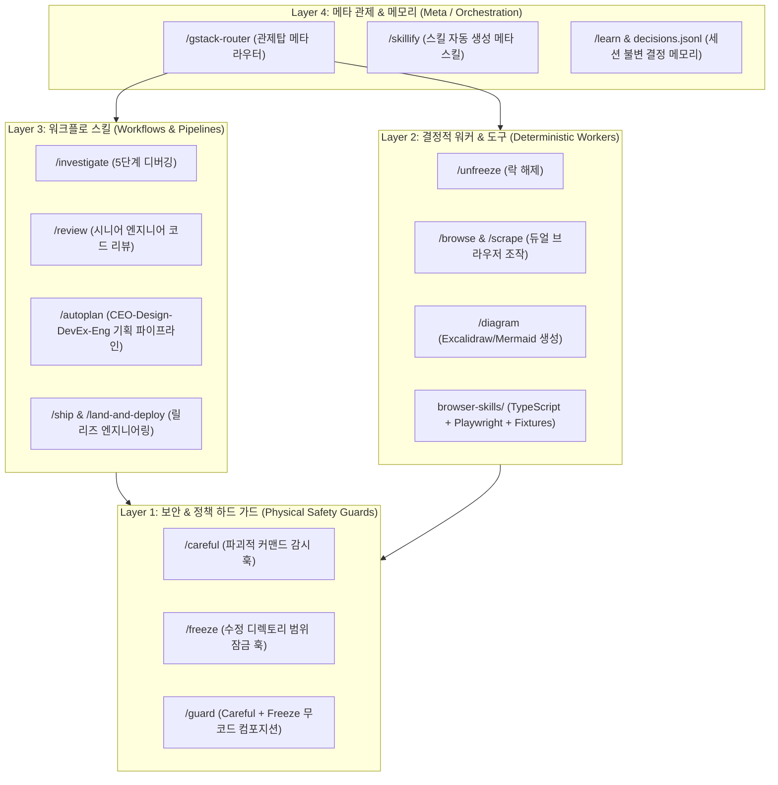
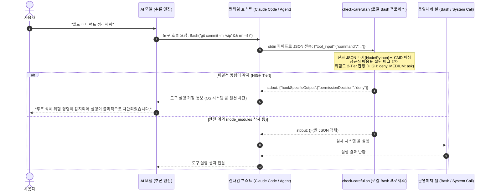
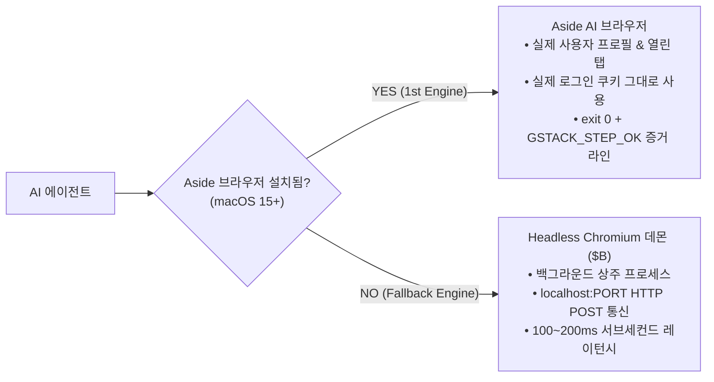

# gstack 아키텍처 맵 & 시스템 시퀀스 (Architecture Map)

이 문서는 Garry Tan의 `gstack` (v1.91.1)이 채택한 시스템 엔지니어링 아키텍처를 시각화합니다.

---

## 1. 4계층 스킬 플릿 아키텍처 (Layered Architecture)

62개 스킬은 단일 목록이 아니라, 명확한 책임과 생명주기를 가진 4개 레이어로 편제됩니다:

---

## 2. PreToolUse Hook 물리적 차단 시퀀스

프롬프트와 달리, 모델의 도구 호출을 OS 쉘 프로세스가 중간에서 물리적으로 가로채는 흐름입니다:

---

## 3. 듀얼 브라우징 엔진 아키텍처 (`ARCHITECTURE.md`)

에이전트가 브라우저를 볼 때 취하는 gstack의 2단계 폴백 아키텍처입니다:

